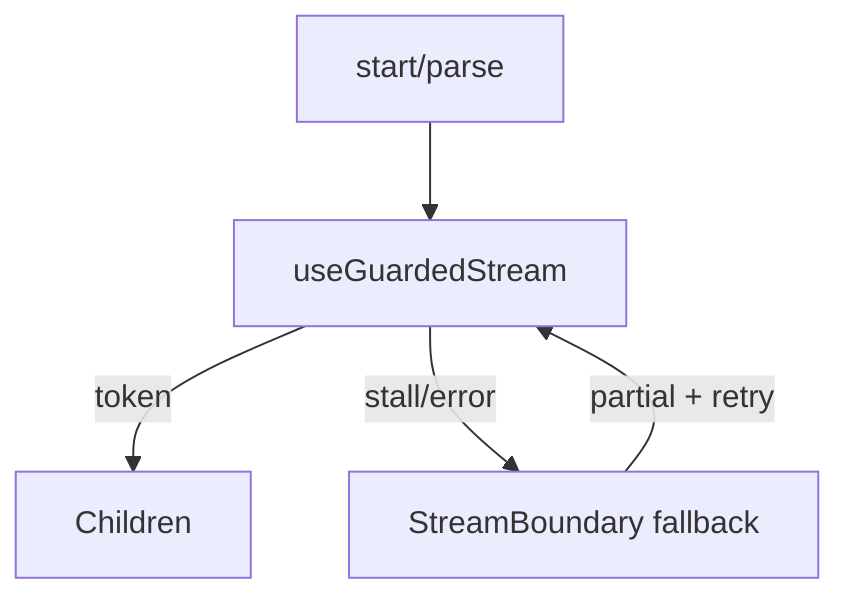

# streamguard-react

React Error Boundaries were built for render errors — streams fail differently.

Headless hooks + an unstyled `StreamBoundary` for streaming LLM UIs:

- Failure classes: connection drop, stall, server error, tool-call failure, abort
- Preserves **partial** tokens in the fallback
- Exponential backoff retry + optional resume-from-checkpoint
- Transport-agnostic via `start` / `parse` (SSE, fetch streams, WebSocket)

## Quickstart

```bash
npm install streamguard-react
```

```tsx
import { useGuardedStream, StreamBoundary } from "streamguard-react";

const stream = useGuardedStream({
  start: (signal) => readSse("/api/chat", signal),
  parse: parseSseEvent,
  stallTimeoutMs: 10_000,
  maxRetries: 2,
  resume: (lastEventId) => readSse(`/api/chat?from=${lastEventId}`),
});

<StreamBoundary
  stream={stream}
  fallback={({ error, partial, retry }) => (
    <>
      <Markdown>{partial}</Markdown>
      <p>{error.message}</p>
      <button onClick={retry}>Continue</button>
    </>
  )}
>
  <Markdown>{stream.tokens}</Markdown>
</StreamBoundary>
```

## Architecture



## License

MIT © Muhammad Zia

## Publishing

Maintainers: see [PUBLISH.md](./PUBLISH.md) for first-time GitHub push and npm release via version tags.
